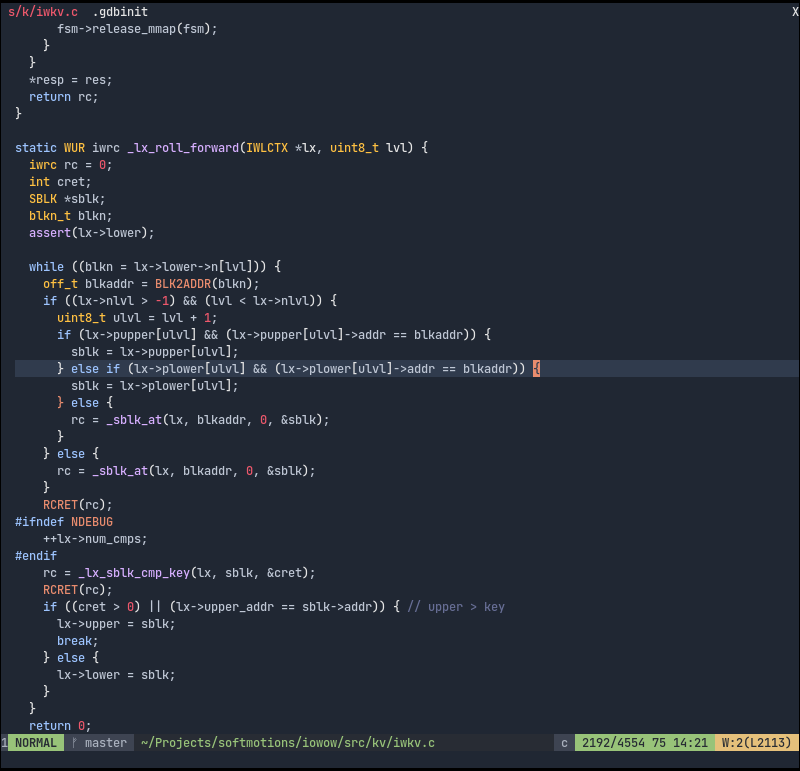

# Dark frost color theme for Vim

This Vim theme is inspired by VSCode [sandricoprovo/dark-frost-vscode-theme](https://github.com/sandricoprovo/dark-frost-vscode-theme) and intendend primary for `C/HTML/CSS` languages.

## Installation

Just copy `colors/darkfrost.vim` to `~/.vim/colors`

or use any vim plugin manager:

```vim
Plug 'Softmotions/vim-dark-frost-theme'
```

Once installed set the color scheme:

```vim
colorscheme darkfrost
```

Enable 24-bit compatibility:

```vim
set termguicolors
```

## Screenshot


