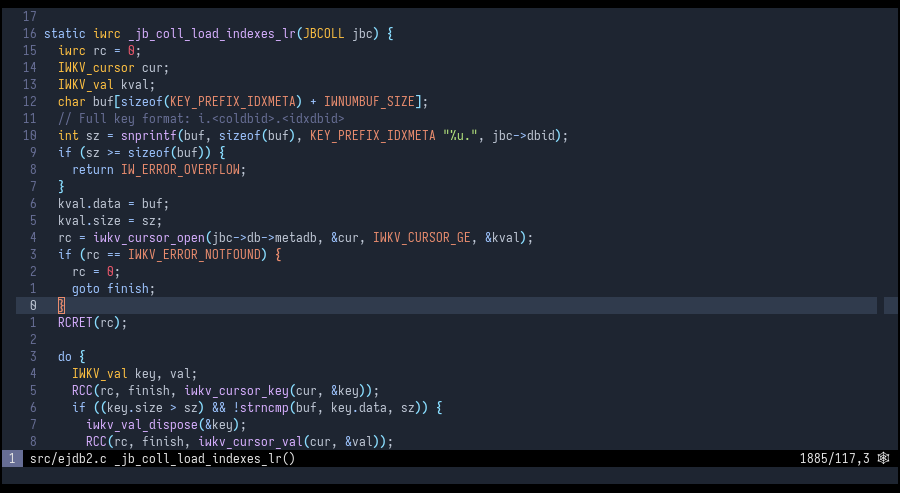

# Dark Frost Color Scheme for Neovim/Vim 




## Installation

Just copy `colors/darkfrost.vim` to `~/.vim/colors`

or use any vim plugin manager:

```vim
Plug 'Softmotions/vim-dark-frost-theme'
```

Once installed set the color scheme:

```vim
set termguicolors
set background=dark
colorscheme darkfrost
```
