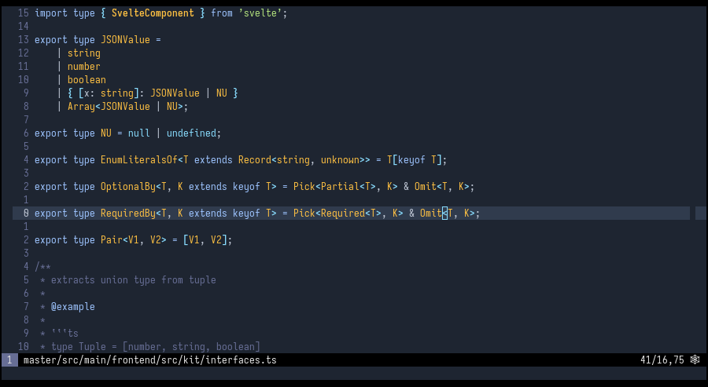

# Dark Frost Color Theme for Neovim/Vim 

This Vim theme is inspired by VSCode sandricoprovo/dark-frost-vscode-theme and intendend primary for Treesitter & Java/C/C++/HTML/CSS



## Installation

Just copy `colors/darkfrost.vim` to `~/.vim/colors`

or use any vim plugin manager:

```vim
Plug 'Softmotions/vim-dark-frost-theme'
```

Once installed set the color scheme:

```vim
colorscheme darkfrost
```

Enable 24-bit compatibility:

```vim
set termguicolors
```
